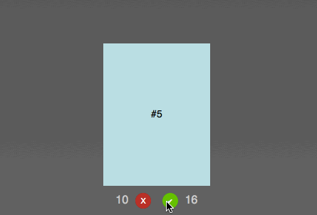

# Tinderesque - a simple Tinder-like card animation and voting system

Using tinderesque you can build your own Tinder-like card animation. It is far from the complexity of the real interface, but is a nice way to spice up a list sorter.



## How it works

The whole functionality of Tinderesque revolves around CSS animations and their JavaScript events. You style and tweak the animations in the `tinderesque.css` file.

## How to use Tinderesque

The Demo Page should show you all you need, it is more or less as simple as including the JavaScript and CSS file into your HTML document and provide it with the proper HTML. The construct for a sortable list is the following:

```html
<div class="cardcontainer list">
  <ul>
    <li class="card current">#1</li>
    <li class="card">#2</li>
    <li class="card">#3</li>
    <li class="card">#4</li>
    <li class="card">#5</li>
    <li class="card">#6</li>
  </ul>
  <button class="but-nope">X</button>
  <button class="but-yay">✔</button>
</div>
```
* The `card` classes are defining the elements to animate and remove. 
* The `current` class defines the currently visible one
* The `but-nope` and `but-yay` buttons have click handlers attached to them, so button elements are the winner here.

## How to extend the functionality

Cards that have been voted on will be removed from the document. The functionality is purely driven by CSS animations, their callback events and you can extend the basic functionality by listening and reacting to custom events:

* `nopecard` fires when the user clicked the "no" button
* `yepcard` fires when the user clicked the "yes" button 
* `cardchosen` fires when the user clicked the current card
* `deckempty` fires when all cards are gone - you can use this to pull new content

Each of the custom events has a payload of three DOM references: 

* `origin` - the button clicked to fire the event (yes or no)
* `container` - the deck container (as there may be several on the same page)
* `card` - the HTML of the card that was removed (in case you need to read the contents)

The `deckempty` event has no card in its payload, the `cardchosen` event has no origin.

You react to users pressing the yay or nay buttons by listening for the the `nopecard` and `yepcard` custom events. This is how I created the nopes and yays counters in the last demo of the intro page.

```javascript
document.body.addEventListener('nopecard', function(ev) {
  var container = ev.detail.container;
  var label = container.querySelector('.nopes');
  if (label) {
    var nopes = +container.nopes || 0;
    nopes++;
    container.nopes = nopes;
    label.innerHTML = container.nopes;
  }
});

document.body.addEventListener('yepcard', function(ev) {
  var container = ev.detail.container;
  var label = container.querySelector('.yays');
  if (label) {
    var yeps = +container.yeps || 0;
    yeps++;
    container.yeps = yeps;
    label.innerHTML = container.yeps;
  }
});
```
You can use the `deckempty` custom event to re-stack the deck. In the demo page this is done thusly:

```javascript
document.body.addEventListener('deckempty', function(ev) {
  var container = ev.detail.container;
  var list = container.querySelector('.cardlist');
  var out = '<li class="card current">#1</li>';
  for (var i = 2; i < 6; i++) {
    out += '<li class="card">#' + i + '</li>';
  }
  list.innerHTML = out;
});
```

This should get you well on the way… 

## But that's not how Tinder works! Where is the touch and drag implementation???

That's the beauty of open source. Fork, build and send me a pull request. 

